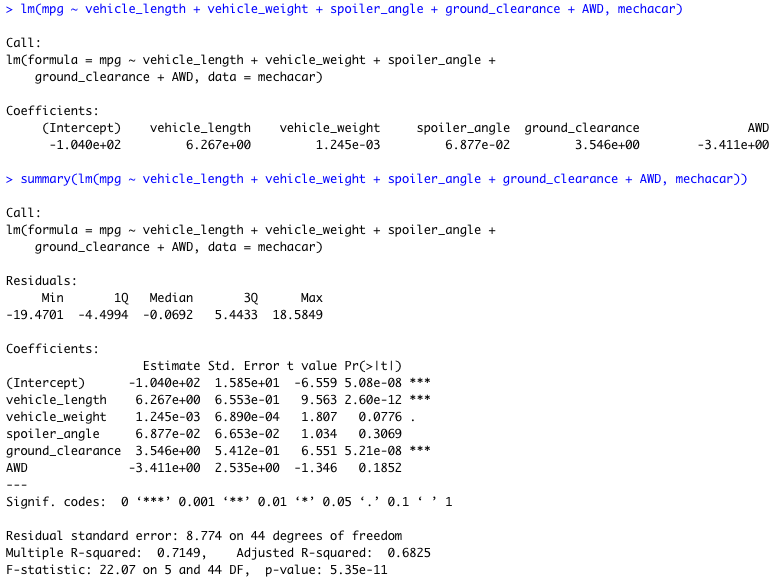
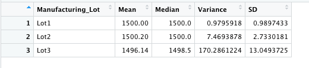
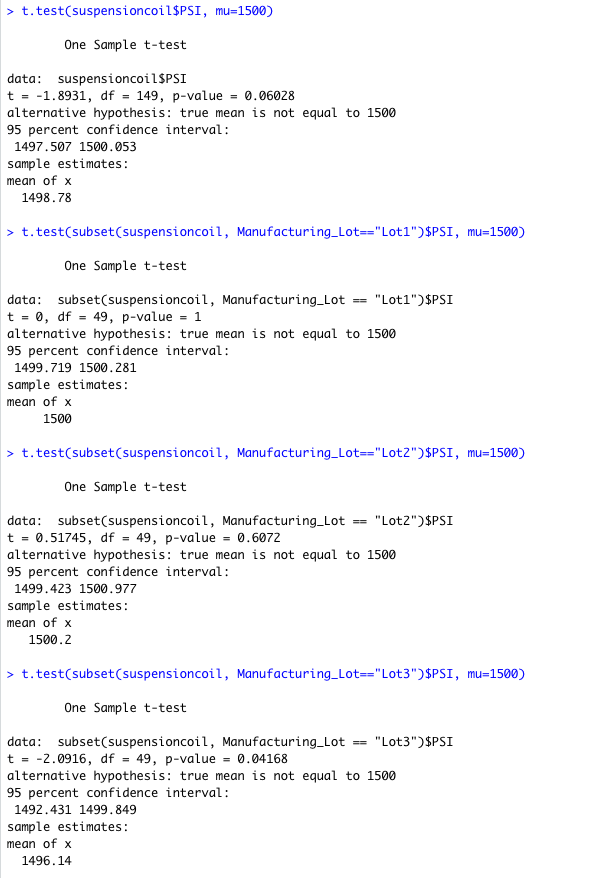

# MechaCar Statistical Analysis

## Overview of Project
This project will use R and RStudio to conduct a number of statistical tests and analyses on the production of a new prototype, the MechaCar by AutosRUs. The prototype is suffering from production troubles and hopefully the production data will provide insights to help the manufacturing team.

## Linear Regression to Predict MPG
#### *Which variables/coefficients provided a non-random amount of variance to the mpg values in the dataset?*
The variables “vehicle_length” and “ground_clearance” provide a non-random amount of variance to the mpg values in the dataset. This is supported by the “***” in significance codes.

#### *Is the slope of the linear model considered to be zero? Why or why not?*
No, the slope of the linear model is not considered to be zero. The p-value of the linear regression is 5.35 x 10^ -11, which is much smaller than the 0.05% significance level. 

#### *Does this linear model predict mpg of MechaCar prototypes effectively? Why or why not?*
Yes, this model somewhat predicts the mpg of the MechaCar prototypes effectively with a Multiple R-Squared value of 0.7149 and p-value of 5.35 x 10^ -11. The model is able to predict effectively about 71.49% of the time.

## Summary Statistics on Suspension Coils
To summarize data on suspension coils, two summary tables were created. ***Table 1*** below provides the mean, median, variance, and standard deviation of the data while ***Table 2*** provides the same but for each of the manufacturing lots.

#### *Does the current manufacturing data meet this design specification for all manufacturing lots in total and each lot individually? Why or why not?*
The design specifications of the MechaCar suspension coils dictate that the variance of the coils must not exceed 100 pounds per square inch. Overall, the analysis supports that the data meets the design specifications overall. Lots 1 and 2 fulfill the specifications as well, being lower than the 100 pounds threshold. Lot 3 on the other hand exceeds the specification.

***Table 1***

***Table 2***

## T-Tests on Suspension Coils
Based on the t-tests performed on the PSI across all lots and across each individual lot, it can be determined that the PSI overall and from Lots 1 and 2 are not statistically different from the population mean of 1500.

The results from Lot 3 indicate that there is statistical difference; the p-value for Lot 3 is 0.04168, which is less than the expected threshold.

## Study Design: MechaCar vs Competition
In order to further explore the possible successes of the MechaCar, it must be compared to its competition on a variety of different specifications that are considered by a potential buyer. Consumers looking to purchase a car will consider a variety of different factors such as safety rating, features, and technology. Depending on the buyer, one common consideration nowadays is whether the car is equipped with backup cameras/ sensors. The null hypothesis in this case would be all cars do not come standard with backup cameras/ sensors. The alternative hypothesis would be that the backup cameras/ sensors are standard on all cars.

An ANOVA test should be used in this instance. Data will need to be collected on the pre-installation of backup camera on the MechaCar or not. 